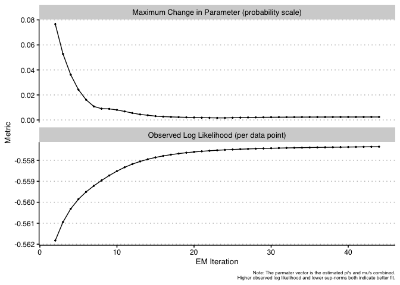

clusterCVR
================

<!-- badges: start -->

[](https://github.com/kuriwaki/cat-mixture/actions)
<!-- badges: end -->

`clusterCVR` provides an EM Algorithm for Mixture Models of Votes with
Varying Choice Sets. It is a clustering algorithm particularly designed
for analyzing mid to high dimensional datasets when voters vote on
Republican or Democratic candidates on the long ballot.

### Loading

``` r
library(clusterCVR)
```

    ## Loading required package: Rcpp

    ## Loading required package: RcppArmadillo

# Derivation

See [**cat-mixture.pdf**](cat-mixture.pdf) for the writeup of the model.
Source is [cat-mixture.tex](cat-mixture.tex)

# Usage

**No varying choice set**

``` r
data("simdata_full")
out_cl <- clusterCVR(simdata_full, init = "kmeans")
```

    ## Loading required package: purrr

    ## Loading required package: glue

    ## 
    ##  iter: 1
    ##  iter: 2
    ##  iter: 3
    ##  iter: 4
    ##  iter: 5
    ##  iter: 6
    ##  iter: 7
    ##  iter: 8
    ##  iter: 9
    ##  iter: 10.........
    ##  iter: 20.........
    ##  iter: 30.........
    ##  iter: 40....
    ##  Done at iter: 44 after 0 mins.

``` r
summary(out_cl)
```

    ## An EM object of class clusterCVR 
    ## Contains 44 iterations 
    ## Estimated with 3 clusters 
    ## Estimated proportions are [0.605, 0.2, 0.195]. 
    ## 
    ## The estimated proportions for STRAIGHT ticket voting
    ## for each cluster (rows) for each office (columns) are: 
    ##             [,1] [,2] [,3] [,4] [,5]
    ## cl_1 (0.60) 0.83 1.00 0.81 0.81 0.98
    ## cl_2 (0.20) 0.91 0.80 0.78 0.84 0.04
    ## cl_3 (0.20) 0.94 0.44 0.90 0.90 0.99
    ## 
    ## The estimated proportions for SPLIT ticket voting
    ## for each cluster (rows) for each office (columns) are: 
    ##             [,1] [,2] [,3] [,4] [,5]
    ## cl_1 (0.60) 0.08 0.00 0.09 0.09 0.00
    ## cl_2 (0.20) 0.05 0.12 0.11 0.12 0.54
    ## cl_3 (0.20) 0.00 0.22 0.07 0.10 0.01
    ## 
    ## The estimated proportions for ROLLOFF
    ## for each cluster (rows) for each office (columns) are: 
    ##             [,1] [,2] [,3] [,4] [,5]
    ## cl_1 (0.60) 0.08 0.00 0.10 0.11 0.02
    ## cl_2 (0.20) 0.05 0.09 0.11 0.05 0.42
    ## cl_3 (0.20) 0.06 0.34 0.04 0.00 0.00

We can also check the log likelihood monotonically increasing:

``` r
pars <- summ_params(out_cl)
graph_trend(pars, simdata_full)
```

    ## Loading required package: ggthemes

    ## Loading required package: lemon

    ## 
    ## Attaching package: 'lemon'

    ## The following object is masked from 'package:purrr':
    ## 
    ##     %||%

<!-- -->

<!-- # Related Packages -->

<!-- Many finite mixture models exist, but almost all are limited to continuous outcomes via Gaussian mixutre models.  The folowing table comes from the `mclust` package R Journal [vignette](https://journal.r-project.org/archive/2016/RJ-2016-021/RJ-2016-021.pdf):  -->

<!-- ```{r, echo = FALSE, out.width = "70%"} -->

<!-- knitr::include_graphics("README-images/mclust-table.png") -->

<!-- ``` -->

<!-- `mclust` is the most downloaded package, with `Rmixmod` coming in second.  [Rmixmod](https://www.jstatsoft.org/article/view/v067i06) is the only package of these that has a interface for analyzing categorical (what they call "qualitative") outcome data. It was recently updated on CRAN (May 2020), and is based on a broader computational library, [MixMod](http://www.mixmod.org/). Here is how it works. -->
